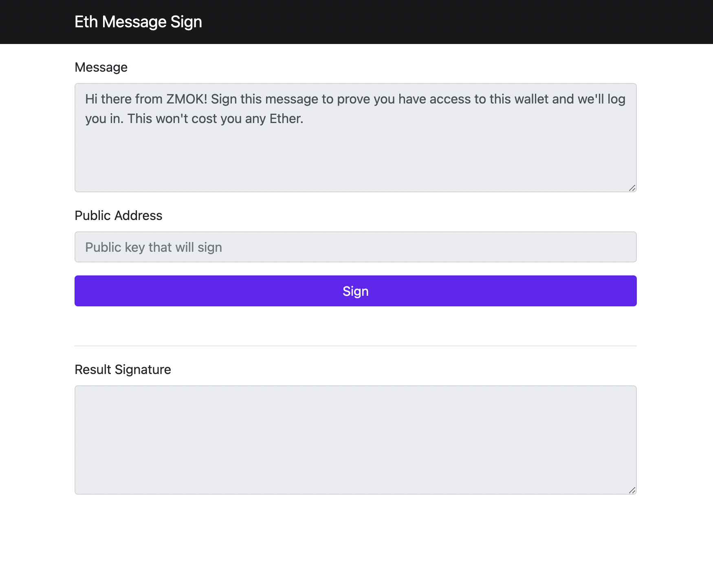

# Eth Message Sign

## [Live hosted HERE](https://docs.zmok.io/eth-message-sign/dist/index.html)

Web3 has its eth.personal.sign function that allows developers to use users private keys to sign messages to prove identity.

Requires MetaMask or some injected Web3 Provider.

## How does it works?

Node.JS > 10 required

* `npm install` to install dependecies
* `npm run start` to run webpack dev server with hot reloading
* Go to `localhost:9000` and start testing
* Accept the connection request from metamask
* Write some data to sign
* Click sign button

## Licensed

MIT
